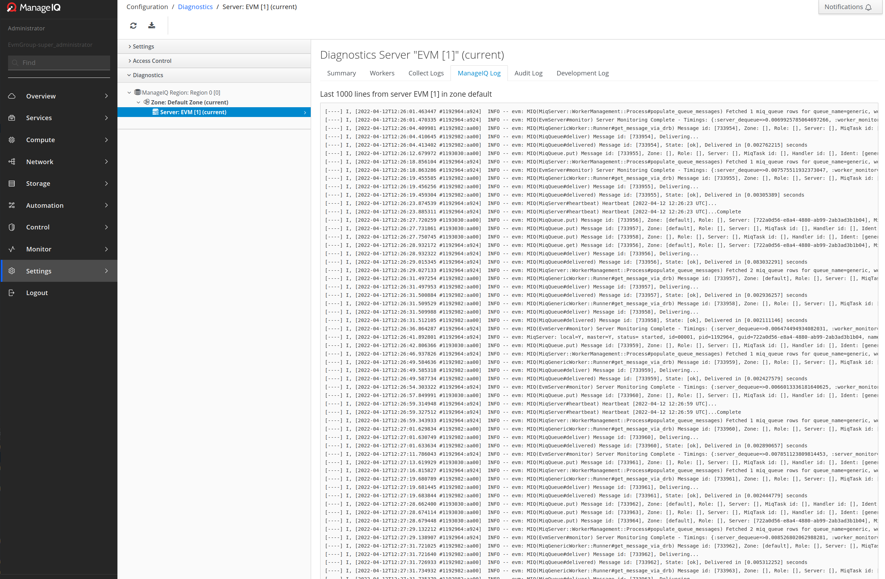

# As an admin I need to be able to review detailed EMS logs

`Control -> Log` opens Last 1000 lines from server EVM in zone `default`. User with role `EvmGroup-super_administrator` can also download entire Policy Log File.

Moreover with the same user role and by navigating to `Settings -> Application Settings -> Digagnostics`, Diagnostic server EVM allows review of Workers, Collect Logs, ManageIQ Logs, Audit Log and Development Log.

